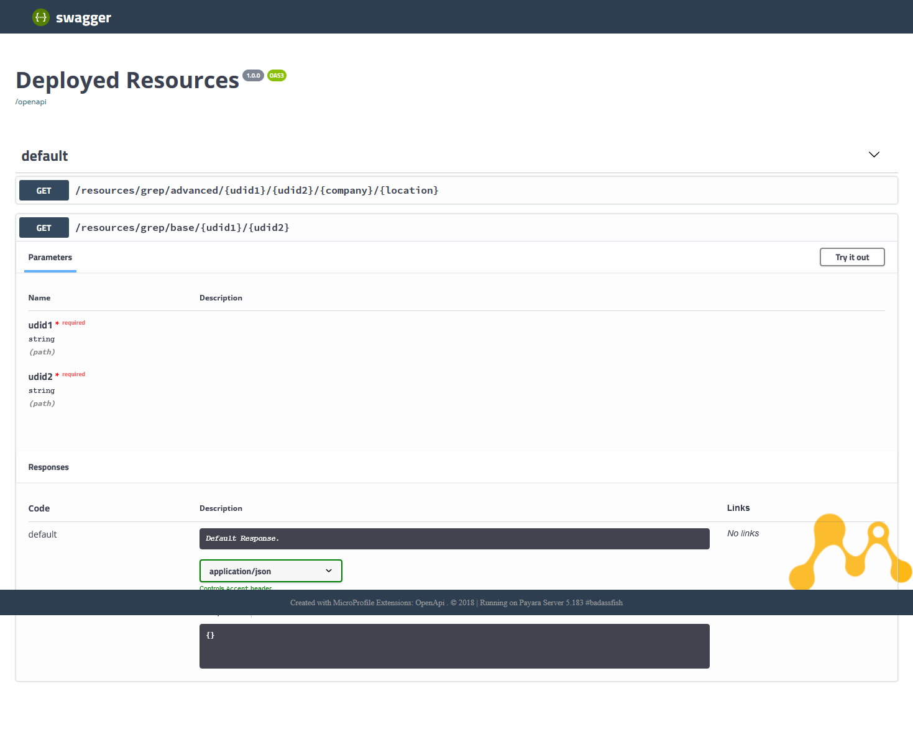

# salestax
a mordern API wrapper araound the german sales tax number validator form the german fed

## Example GET Call to the API:
http://localhost:8080/resources/grep/base/DE123456789/SE12345678910

